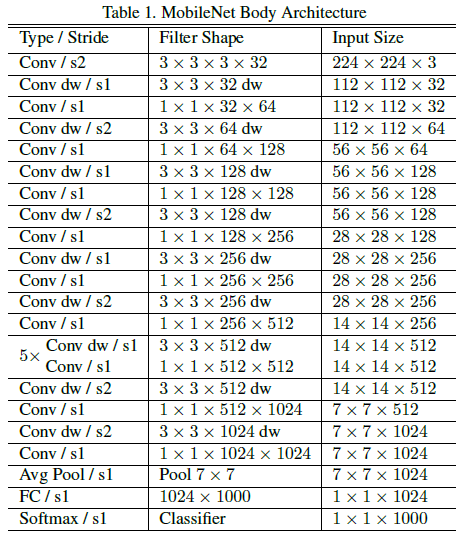
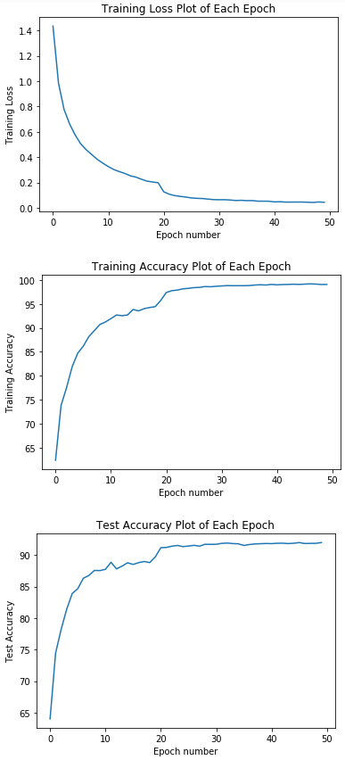

# Project-MobileNet
Implementation of MobileNet, trained and tested on CIFAR10
 
Paper: MobileNets: Efficient Convolutional Neural Networks for Mobile Vision Applications. [read](https://github.com/ZhengMichaelLiu/Project-MobileNet/blob/master/MobileNets%20Efficient%20Convolutional%20Neural%20Networks%20for%20Mobile%20Vision%20Applications.pdf)

## Architecture

Input: 224 x 224 RGB images. Data in CIFAR10 has size 32 x 32, resize them to 224 x 224

Optimizer: Adam, with initial learning rate: 0.001

Scheduler: After each 20 epochs, the learning rate is decreased by 10 times.

## Result: Loss, Accuracy

Final Accuracy: 92.00%

Here is the graphs of training loss, training accuracy and test accuracy

Note that the parameters are not fully tuned and optimized, you can try more parameters to get better result.

## Under Construction

This project is still under construction. For now, it is just a defined network in Jupyter Notebook. In the future, I will convert format to be more formal. And I will also try to apply the network to different applications, like they did in original paper:
    1. Fine Grained Recognition
    2. Large Scale Geolocalization
    3. Face Attributes
    4. Object Detection
    5. Face Embedding
